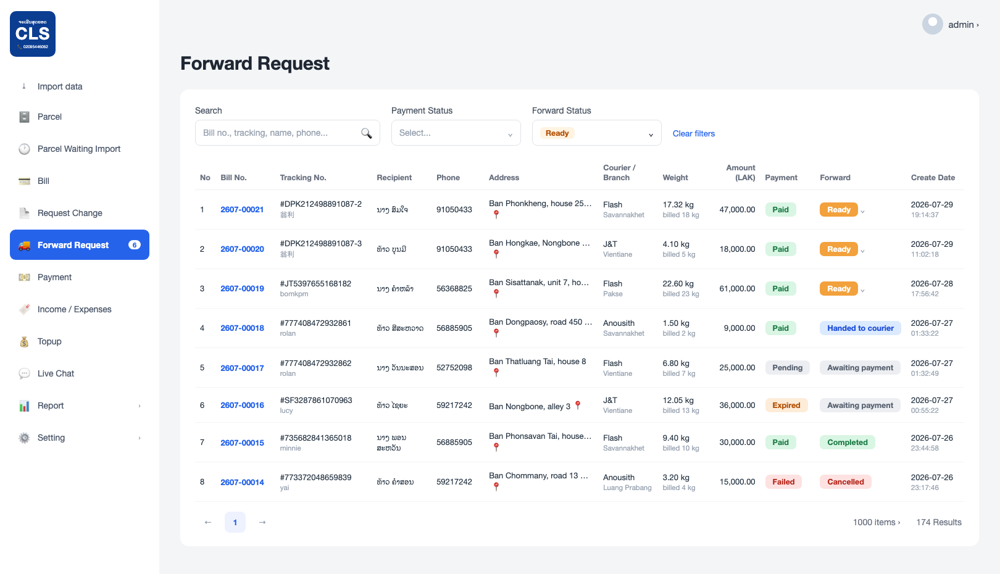

# Spec ฝั่ง Admin (Back Office): หน้า Forward Request — รายการคำขอส่งต่อพัสดุ

**ผู้ขอ:** ทีม Mobile (ZTO_APP / Flutter)
**วันที่:** 2026-07-30
**Base URL:** `http://14.207.141.82/api/v1`
**ขอบเขตเอกสารนี้:** เฉพาะ **หน้ารายการ (list page)** — ยังไม่รวมหน้า detail
**เอกสารที่เกี่ยวข้อง:** `BACKEND_SPEC_PAYMENT_RECEIPT.md` (billNo / paymentNo / amount / paidAt)

---

## 1. ที่มา — flow ฝั่งแอป

ลูกค้ากด **Send** ในแอปแล้วทำตามลำดับนี้:

1. **Select parcel to forward** — เลือกพัสดุ 1 ชิ้นจากรายการของตัวเอง
2. **Recipient details** — กรอกชื่อผู้รับ / เบอร์ผู้รับ / ที่อยู่ผู้รับ / courier service / delivery branch
3. **Pin recipient address** — ปักหมุดบนแผนที่ ได้ `lat`, `lng`
4. **Forwarding payment** — สรุปน้ำหนัก + ค่าส่งต่อ
5. **Pay for service** — BCEL ONE → สแกน QR → ใบเสร็จ (barcode ของ Bill No.)

แอปยิง `POST /orders/forward` ด้วย body:

```json
{
  "parcels": [
    {
      "laravelParcelId": "1024",
      "recipientName": "ນາງ ສົມໃຈ",
      "recipientPhone": "9xxxxxxx",
      "recipientAddress": "Ban Phonkheng, house 25, road 13",
      "courierName": "Flash",
      "branchName": "Savannakhet",
      "lat": 17.9757,
      "lng": 102.6331
    }
  ]
}
```

> อ้างอิง: `lib/features/send/data/send_repository.dart` → `CreateForwardRequest.toJson()`

**ข้อมูลทั้งหมดนี้เข้าระบบแล้ว แต่ยังไม่มีหน้าให้แอดมินเห็น** — เอกสารนี้คือหน้าที่ขอให้ทำเพิ่ม

---

## 2. ตำแหน่งในเมนู

```
Import data
Parcel
Parcel Waiting Import
Bill
Request Change
Forward Request     ⭐ เพิ่มใหม่ (พร้อม badge จำนวนงานค้าง)
Payment
Income / Expenses
Topup
Live Chat
Report
Setting
```

**URL:** `/forwardRequest`
**Badge บนเมนู:** จำนวนรายการที่ `forwardStatus = ready` (งานที่แอดมินต้องทำ)

---

## 3. หลักการออกแบบสำคัญ — แยก 2 สถานะออกจากกัน

หน้านี้ **ห้าม** ใช้คอลัมน์สถานะเดียวเหมือนหน้า Bill เพราะเป็นคนละเรื่องกัน:

| | ความหมาย | ใครเป็นคนเปลี่ยน |
|---|---|---|
| **Payment Status** | ลูกค้าจ่ายค่าส่งต่อแล้วหรือยัง | ระบบ (callback จาก BCEL) |
| **Forward Status** | แอดมินจัดการพัสดุถึงขั้นไหนแล้ว | แอดมิน (กดเอง) |

ถ้ารวมเป็นคอลัมน์เดียว แอดมินจะแยกไม่ออกระหว่าง
"จ่ายเงินแล้วแต่ยังไม่ได้ส่งให้ขนส่ง" กับ "ยังไม่จ่ายเงิน" → ของตกค้างแน่นอน

---

## 4. Layout หน้าจอ

**ภาพ mockup:** `docs/mockups/admin_forward_request.png`
(ไฟล์ต้นฉบับ HTML: `docs/mockups/admin_forward_request.html` — เปิดในเบราว์เซอร์ได้เลย)



โครงร่างแบบ text:

```
Forward Request                                          [ Export CSV ]

┌───────────────────────────────────────────────────────────────────────┐
│ Search                Payment Status     Forward Status               │
│ [Search...        🔍] [Select...     ▾] [Ready         ▾] Clear filters│
│                                                                       │
│ No  Bill No.    Tracking No.         Recipient     Phone      Address │
│ ───────────────────────────────────────────────────────────────────── │
│ 1   2607-00021  #DPK212498891087-2   ນາງ ສົມໃຈ     9xxxxxxx   Ban… 📍│
│                                                                       │
│     Courier /   Weight       Amount     Payment   Forward     Create  │
│     Branch                   (LAK)                             Date   │
│ ───────────────────────────────────────────────────────────────────── │
│     Flash /     17.32 kg     47,000.00  [Paid]    [Ready ⌄]   2026-07-│
│     Savannakhet billed 18 kg                                  30 20:34│
└───────────────────────────────────────────────────────────────────────┘
                                              1000 items ›   174 Results
```

สไตล์ card / filter bar / pagination ให้ใช้ชุดเดียวกับหน้า `Bill` และ `Payment` ที่มีอยู่แล้ว

---

## 5. คอลัมน์หลัก (must-have)

| # | Column | ตัวอย่าง | รายละเอียด |
|---|---|---|---|
| 1 | `No` | `1` | running ตามหน้า |
| 2 | `Bill No.` | `2607-00021` | คลิกได้ → ลิงก์ไปหน้า Bill โดยกรองด้วยเลขนี้ |
| 3 | `Tracking No.` | `#DPK212498891087-2` | เลขพัสดุที่ถูกส่งต่อ + ปุ่ม copy (บรรทัดล่างเป็นชื่อพัสดุเดิม) |
| 4 | `Recipient` | `ນາງ ສົມໃຈ` | ชื่อผู้รับที่ลูกค้ากรอกในแอป |
| 5 | `Phone` | `9xxxxxxx` | เบอร์ผู้รับ + ปุ่ม copy (แอดมินต้องโทรบ่อย) |
| 6 | `Address` | `Ban Phonkheng, house 25…` | ตัด 1 บรรทัด, hover เห็นเต็ม, ไอคอน 📍 เปิด Google Maps ด้วย `lat,lng` |
| 7 | `Courier / Branch` | `Flash / Savannakhet` | 2 บรรทัดในช่องเดียว |
| 8 | `Weight` | `17.32 kg / billed 18 kg` | น้ำหนักจริง + น้ำหนักที่คิดเงินบรรทัดล่าง |
| 9 | `Amount (LAK)` | `47,000.00` | ชิดขวา, thousand separator |
| 10 | `Payment` | `Paid` | badge (ดูข้อ 6) — read-only |
| 11 | `Forward` | `Ready ⌄` | badge + เปลี่ยนสถานะได้จาก dropdown ในแถวเลย |
| 12 | `Create Date` | `2026-07-30 20:34:11` | **default sort — ใหม่สุดบนสุด** |
| 13 | `Update Date` | `2026-07-30 21:02:55` | |

> ไม่มีคอลัมน์ checkbox และไม่มีคอลัมน์ Actions — หน้านี้เป็นหน้าดูรายการอย่างเดียว
> การกระทำเดียวที่ทำได้ในหน้านี้คือเปลี่ยน `Forward` จาก dropdown ในแถว

### คอลัมน์รอง (ซ่อนไว้ — เปิดผ่านปุ่ม `Columns` หรือแสดงใน tooltip)

`Payment No.` (`SK2607-00002`) · `Payment method` (`BCEL ONE`) · `Paid At` ·
`Sender name` / `Sender phone` (บัญชีลูกค้าที่กดส่ง) · `Destination coordinates` (`17.975700, 102.633100`) ·
`Order ID` · `Courier tracking no.`

---

## 6. Badge สถานะ

### 6.1 Payment Status (ใช้สีชุดเดียวกับหน้า Payment เดิม)

| Value | Label | สี | เงื่อนไข |
|---|---|---|---|
| `pending` | `Pending` | เทา | สร้าง order แล้ว ยังไม่สแกน QR |
| `paid` | `Paid` | เขียว | ได้ callback จาก BCEL แล้ว |
| `failed` | `Failed` | แดง | จ่ายไม่สำเร็จ |
| `expired` | `Expired` | ส้มอ่อน | QR หมดอายุ (แอป timeout ที่ 5 นาที) |
| `refunded` | `Refunded` | ม่วง | คืนเงินแล้ว |

### 6.2 Forward Status

| Value | Label | สี | ความหมาย |
|---|---|---|---|
| `awaiting_payment` | `Awaiting payment` | เทา | ยังไม่จ่าย → **ห้ามปล่อยของ** |
| `ready` | `Ready` | ส้ม | จ่ายแล้ว รอแอดมินจัดการ ⭐ คิวงานหลัก |
| `handed_to_courier` | `Handed to courier` | ฟ้า | ส่งให้ Flash / J&T แล้ว |
| `completed` | `Completed` | เขียว | ผู้รับได้รับของแล้ว |
| `cancelled` | `Cancelled` | แดง | ยกเลิก (ต้องบันทึกเหตุผล) |

**กฎ transition:**

```
awaiting_payment ──(payment = paid)──▶ ready ──▶ handed_to_courier ──▶ completed
        │                                │                │
        └────────────────────────────────┴────────────────┴──▶ cancelled (ต้องกรอกเหตุผล)
```

- ออกจาก `awaiting_payment` ได้ก็ต่อเมื่อ `paymentStatus = paid` เท่านั้น (บังคับที่ backend ไม่ใช่แค่ซ่อนปุ่ม)
- ย้อนสถานะกลับไม่ได้ ยกเว้น `cancelled` ที่กดได้จากทุกสถานะก่อน `completed`

---

## 7. Filter / Search

| ตัวกรอง | รายละเอียด |
|---|---|
| `Search` | ค้นครอบคลุม: Bill No., Tracking No., ชื่อผู้รับ, เบอร์ผู้รับ, เบอร์ผู้ส่ง |
| `Payment Status` | dropdown ตามข้อ 6.1 |
| `Forward Status` | dropdown ตามข้อ 6.2 — **default = `Ready`** |
| `Clear filters` | ล้างทั้งหมด |

> เหตุผลที่ default filter เป็น `Ready`: เปิดหน้ามาแล้วเห็น "งานที่ต้องทำวันนี้" ทันที
> ไม่ต้องไล่หาในรายการ 174 แถว ถ้าอยากเห็นทั้งหมดค่อยกด Clear filters

---

## 8. สิ่งที่ **ไม่มี** ในหน้านี้ (ตัดออกโดยตั้งใจ)

- ❌ ปุ่ม `Export CSV`
- ❌ checkbox หน้าแถว + bulk action ทุกชนิด
- ❌ คอลัมน์ `Actions` (👁 / 📍 / 🖨)
- ❌ จุดแดงเตือน SLA
- ❌ ตัวกรอง `Date range`

หน้านี้โฟกัสที่ "ดูรายการ + เปลี่ยนสถานะ Forward" เท่านั้น

---

## 9. รายละเอียดปลีกย่อยที่ควรมี

- **Empty state:** `No forward requests found` + ปุ่ม `Clear filters`
- **Pagination:** ล้อของเดิม `1000 items ›` + `N Results`
- **Timezone:** แสดงเป็น Asia/Vientiane ให้ตรงกับเวลาบนใบเสร็จในแอป
- **Copy:** ปุ่ม copy บน Tracking No. / Phone / Coordinates
- **แผนที่:** ไอคอน 📍 เปิด `https://www.google.com/maps?q={lat},{lng}` แท็บใหม่
- **Audit:** เก็บว่าใครเปลี่ยนสถานะและเมื่อไหร่ (แสดงใน tooltip ของคอลัมน์ Forward)

---

## 10. Field ที่ backend ต้องเพิ่ม

ข้อมูลจากแอปมีครบแล้ว (ข้อ 1) ที่ขาดคือ field ฝั่งการจัดการของแอดมิน:

| field | type | required | หมายเหตุ |
|---|---|---|---|
| `forwardStatus` | enum | ✅ | 5 ค่าตามข้อ 6.2 — default `awaiting_payment` |
| `handedOverAt` | ISO datetime \| null | | เวลาที่ส่งให้ขนส่ง |
| `completedAt` | ISO datetime \| null | | เวลาที่ปิดงาน |
| `cancelReason` | string \| null | | บังคับกรอกเมื่อเปลี่ยนเป็น `cancelled` |
| `handledBy` | string \| null | | ชื่อ/ID แอดมินที่เปลี่ยนสถานะล่าสุด (audit) |
| `courierTrackingNo` | string \| null | | เลข tracking ของ Flash / J&T หลังส่งต่อ — เผื่ออนาคตให้ลูกค้าติดตามต่อในแอปได้ |

ส่วน `billNo` / `paymentNo` / `amount` / `paidAt` ใช้ชุดเดียวกับที่ขอไว้ใน
`BACKEND_SPEC_PAYMENT_RECEIPT.md` — ไม่ต้องทำซ้ำ

---

## 11. Endpoint ที่ต้องมีสำหรับหน้านี้

### 11.1 `GET /admin/forward-requests` — รายการ

Query params:

| param | ตัวอย่าง | หมายเหตุ |
|---|---|---|
| `search` | `2607-00021` | ค้นตามข้อ 7 |
| `paymentStatus` | `paid` | |
| `forwardStatus` | `ready` | |
| `page` / `pageSize` | `1` / `1000` | ล้อของเดิม |
| `sortBy` / `sortDir` | `createdAt` / `desc` | default |

Response:

```json
{
  "success": true,
  "data": {
    "items": [
      {
        "orderId": "ord_01J...",
        "billNo": "2607-00021",
        "paymentNo": "SK2607-00003",
        "trackingNo": "DPK212498891087-2",
        "senderName": "rolan",
        "senderPhone": "91050433",
        "recipientName": "ນາງ ສົມໃຈ",
        "recipientPhone": "9xxxxxxx",
        "recipientAddress": "Ban Phonkheng, house 25, road 13",
        "lat": 17.9757,
        "lng": 102.6331,
        "courierName": "Flash",
        "branchName": "Savannakhet",
        "weight": 17.32,
        "billedWeight": 18,
        "amount": 47000,
        "currency": "LAK",
        "paymentStatus": "paid",
        "paymentMethod": "onepay",
        "paidAt": "2026-07-30T20:36:12.000Z",
        "forwardStatus": "ready",
        "handedOverAt": null,
        "completedAt": null,
        "courierTrackingNo": null,
        "cancelReason": null,
        "handledBy": null,
        "createdAt": "2026-07-30T20:34:11.000Z",
        "updatedAt": "2026-07-30T20:36:12.000Z"
      }
    ],
    "page": 1,
    "pageSize": 1000,
    "total": 174
  }
}
```

### 11.2 `PATCH /admin/forward-requests/:orderId/status` — เปลี่ยนสถานะจากในแถว

```json
{
  "forwardStatus": "handed_to_courier",
  "courierTrackingNo": "TH0123456789",
  "cancelReason": null
}
```

- ตรวจ transition ตามข้อ 6.2 ที่ backend — ถ้าไม่ถูกต้องตอบ `422`
- `cancelReason` บังคับเมื่อ `forwardStatus = cancelled`
- บันทึก `handledBy` จาก token ของแอดมินที่เรียก

> ไม่มี endpoint แบบ bulk — หน้านี้ไม่มี bulk action

---

## 12. Checklist

- [ ] เพิ่มเมนู `Forward Request` + badge จำนวน `ready`
- [ ] ตารางรายการตามข้อ 5 (13 คอลัมน์ — ไม่มี checkbox / Actions)
- [ ] Badge 2 ชุดแยกกันตามข้อ 6
- [ ] Filter ตามข้อ 7 — Search / Payment Status / Forward Status (default `Ready`) / Clear filters
- [ ] เพิ่ม field ตามข้อ 10 ใน entity / DB
- [ ] `GET /admin/forward-requests`
- [ ] `PATCH /admin/forward-requests/:orderId/status` + ตรวจ transition
